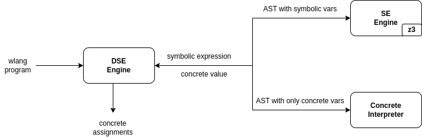
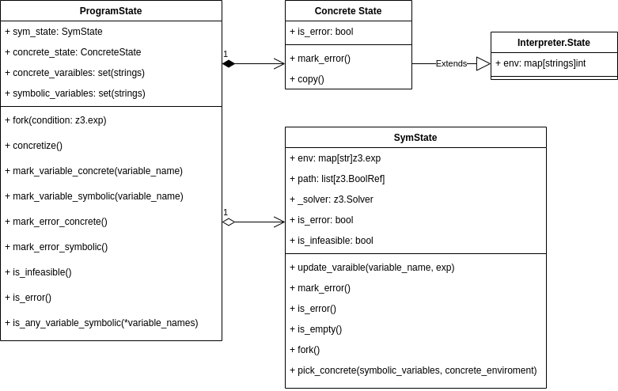
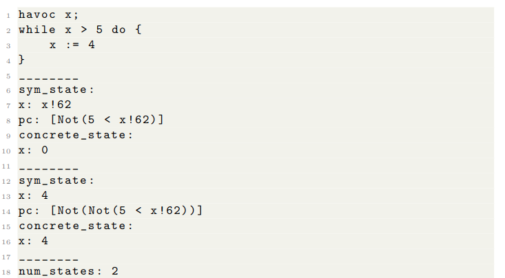

# Dynamic Symbolic Execution Engine (DSE Engine) For WLang
## Introduction
This project develops a Dynamic Symbolic Execution (DSE) Engine tailored for the vanilla programming language WHILE, incorporating the incremental solving feature of Z3. The engine aims at combining symbolic and concrete executions to efficiently navigate through different paths within a program, enhancing path exploration and problem-solving capabilities.

## Features
* Dynamic Symbolic Execution in EXE style for efficient path exploration.
* Utilization of Z3 for incremental solving, enhancing performance.
* Concrete execution fallback for handling non-symbolic or complex paths.
* Dual execution approach for thorough program analysis.
* Variable extraction and management for improved execution accuracy.

## Implementation
Built on top of the SE engine from the famous EXE , our DSE Engine integrates with a concrete interpreter, optimizing execution by shifting between symbolic and concrete modes based on the context. The engine supports smart concretization strategies to handle challenging symbolic variables and employs incremental solving to enhance efficiency.

The DSE engine will concretize symbolic variables when symbolic execution is hard. We added a timeout of 1000 ms to the underlying solver. Whenever the solver outputs "unknown", the `pick_concrete` replace the symbolic expression in path condition for a symbolic variable with a `IntVal` of the concrete value of the variable and add a path condition constraining the variable to be equal  to the concrete value. our implementation used the `z3.subsitute` to concretize path conditions and added the new path condition . If such efforts failed, the symbolic path is discarded.



*Figure 1: DSE Engine Architecture*



*Figure 2: The UML diagram of the Program State Class*

This image shows the results of the DSE Engine, including the branch coverage and the handling of intricate symbolic conditions.

Please note that the actual path of the images may vary based on where you store them in your project directory.

## Evaluation
Our DSE Engine demonstrates significant effectiveness in symbolic execution, managing to navigate complex program paths and handle nested conditions efficiently. The engine showcases a high degree of branch coverage and demonstrates improvements over traditional SE engines, particularly in handling intricate symbolic conditions.


*Figure 3: Example of DSE Engine Execution*

## Conclusion
While the current implementation showcases the potential of DSE, there are opportunities for improvement, particularly in test vector generation and concretization strategies. Future enhancements could adopt advanced techniques such as fuzzing for better concretization and error state exploration.

## References
References include works by Arie Gurfinkel, Irlbeck M., Nikolaj Bjørner, Leonardo de Moura, and others on the foundations and advancements in dynamic symbolic execution and program analysis.


## Usage
```python3 -m wlang.sym wlang/dynamic_sym_exe_testcases/fermat.prg ```